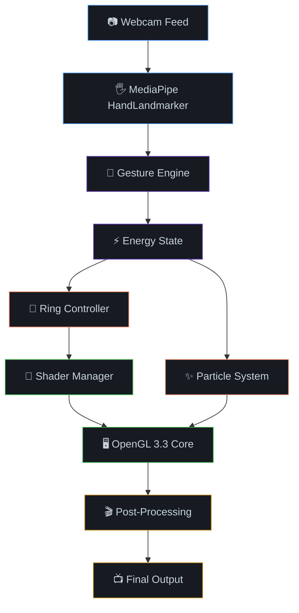

<div align="center">

<!-- ═══════════════════════════════════════════════════════════════════════ -->
<!--                          ANIMATED HEADER                              -->
<!-- ═══════════════════════════════════════════════════════════════════════ -->


<!-- Animated typing effect -->
<a href="https://git.io/typing-svg">
  
</a>

<br/>

<!-- ═══════════════════════════════════════════════════════════════════════ -->
<!--                         INTERACTIVE BADGES                            -->
<!-- ═══════════════════════════════════════════════════════════════════════ -->

[](https://python.org)
[](https://www.opengl.org/)
[](https://mediapipe.dev)
[](#-shader-pipeline)
[](#license)

<br/>

[](https://github.com/sarthakbhopale/hand-tracked-glass-rings)
[](https://github.com/sarthakbhopale/hand-tracked-glass-rings)

<br/>

<!-- Animated divider -->


</div>

---

<div align="center">

## ✨ Overview

**A cinematic AR experience that renders real-time 3D glass torus rings on your fingers,**
**powered by GPU GLSL shaders, MediaPipe hand tracking, and gesture-reactive animations.**

<br/>

Every ring refracts light with **chromatic aberration**, shimmers with **Fresnel iridescence**,
and responds dynamically to **hand gestures** — creating a premium, cinematic visual effect.

<br/>

<!-- Feature highlights with animated icons -->
<table>
<tr>
<td align="center" width="25%">

<br/><b>Hand Tracking</b>
<br/><sub>21-point landmark detection<br/>with Kalman smoothing</sub>
</td>
<td align="center" width="25%">

<br/><b>Glass Shaders</b>
<br/><sub>6 GLSL shader modes<br/>with real-time refraction</sub>
</td>
<td align="center" width="25%">

<br/><b>Gesture Engine</b>
<br/><sub>Static + temporal gestures<br/>with two-hand interaction</sub>
</td>
<td align="center" width="25%">

<br/><b>Post-Processing</b>
<br/><sub>Bloom, chromatic aberration<br/>shockwave, vignette</sub>
</td>
</tr>
</table>

</div>

---

<div align="center">

## 🎮 Gesture Controls

<br/>

| Gesture | Effect | Visual |
|:---:|:---:|:---:|
| ✋ **Open Palm** | Rings expand outward & pulse with breathing animation | `scale 1.1→1.25` · gentle wobble |
| ✊ **Fist** | Rings contract tight & glow hot orange | `scale 0.6` · tumble spin · max glow |
| 🤏 **Pinch** | Pinched finger rings orbit rapidly like spinning coins | `360°/s X` · `540°/s Y` · `180°/s Z` |
| ✌️ **Peace** | Rainbow caustic explosion on index + middle fingers | `rainbow 1.0` · `scale 1.4` · fast wobble |
| 👆 **Point** | Directional energy beam from index finger | energy arc particles |
| 🤌 **Snap** | Shockwave ripple effect from snap point | post-processing ripple |
| 🫸🫷 **Two-Hand Pull** | Energy field stretches between hands | particle bridges |
| 🫷🫸 **Two-Hand Compress** | Energy field compresses with intensity | compressed glow |

</div>

---

<div align="center">

## 🎨 Shader Pipeline

**6 switchable GLSL fragment shader modes — all running in real-time on the GPU**

<br/>

</div>

<div align="center">

<table>
<tr>
<td align="center"><b>Mode</b></td>
<td align="center"><b>Name</b></td>
<td align="center"><b>Description</b></td>
</tr>
<tr>
<td align="center"><code>0</code></td>
<td align="center">🔮 Advanced Glass</td>
<td align="center">Multi-layer Fresnel, 5-tap chromatic aberration, FBM ripple</td>
</tr>
<tr>
<td align="center"><code>1</code></td>
<td align="center">💧 Liquid Refraction</td>
<td align="center">Flowing caustics, viscous deformation, water-like distortion</td>
</tr>
<tr>
<td align="center"><code>2</code></td>
<td align="center">⚡ Plasma Energy</td>
<td align="center">FBM emissive glow, pulsing veins, electric arc patterns</td>
</tr>
<tr>
<td align="center"><code>3</code></td>
<td align="center">📡 Holographic</td>
<td align="center">Scanlines, wireframe overlay, RGB shift, digital flicker</td>
</tr>
<tr>
<td align="center"><code>4</code></td>
<td align="center">🌀 Void Crystal</td>
<td align="center">Dark matter absorption, void distortion, crystal refraction</td>
</tr>
<tr>
<td align="center"><code>5</code></td>
<td align="center">🔥 Solar Flare</td>
<td align="center">Fire emission, solar prominance, heat haze distortion</td>
</tr>
</table>

</div>

<div align="center">

### 🔬 Core Shader Techniques

</div>

<div align="center">

```glsl
// ═══════════════════════════════════════════
//  CHROMATIC ABERRATION — Glass Dispersion
// ═══════════════════════════════════════════

float eta_R = 1.0 / 1.47;   // Red channel IOR
float eta_G = 1.0 / 1.50;   // Green channel IOR
float eta_B = 1.0 / 1.53;   // Blue channel IOR

vec3 refR = refract(-V, N, eta_R);
vec3 refG = refract(-V, N, eta_G);
vec3 refB = refract(-V, N, eta_B);

vec3 refractedColor = vec3(
    texture(bgTexture, uvR).r,   // Red from shifted UV
    texture(bgTexture, uvG).g,   // Green from shifted UV
    texture(bgTexture, uvB).b    // Blue from shifted UV
);
```

```glsl
// ═══════════════════════════════════════════
//  FRESNEL + IRIDESCENCE — Rainbow Caustics
// ═══════════════════════════════════════════

float cosTheta = max(dot(N, V), 0.0);
float fresnel = 0.04 + 0.96 * pow(1.0 - cosTheta, 5.0);

vec3 iridescence = vec3(
    0.5 + 0.5 * sin(angle * 6.2832 + 0.0),
    0.5 + 0.5 * sin(angle * 6.2832 + 2.094),
    0.5 + 0.5 * sin(angle * 6.2832 + 4.189)
);

vec3 color = mix(refractedColor, iridescence, fresnel * rainbowMix);
```

```glsl
// ═══════════════════════════════════════════
//  PROCEDURAL VERTEX DISPLACEMENT — FBM Noise
// ═══════════════════════════════════════════

float hash(float n) { return fract(sin(n) * 43758.5453123); }

float fbm(vec3 p) {
    float v = 0.0; float a = 0.5;
    for(int i = 0; i < 3; i++) {
        v += a * noise3d(p);
        p *= 2.01; a *= 0.5;
    }
    return v;
}
// Organic undulation: displace along normal
pos += norm * fbm(pos * 3.0 + uTime * 0.5) * uDeformAmount;
```

</div>

---

<div align="center">

## 🏗️ Architecture



</div>

---

<div align="center">

## 📁 Project Structure

```
hand-tracked-glass-rings/
├── 🚀 main.py               # Entry point — ties all modules together
├── 💍 glass_torus_ar.py      # Core AR renderer + torus geometry + GLSL shaders
├── 🎨 shader_manager.py      # 6 switchable GLSL shader modes
├── 🎯 gesture_engine.py      # Static + temporal gesture recognition
├── ⚡ energy_state.py        # Energy state machine for visual effects
├── 🎮 ring_controller.py     # Per-finger ring positioning & animation
├── ✨ particle_system.py     # GPU-efficient orbit particles & energy arcs
├── 🎬 post_processing.py     # FBO bloom, chromatic aberration, shockwave
├── 🧮 math_utils.py          # Matrix utilities & Kalman filters
├── 🤖 hand_landmarker.task   # MediaPipe hand tracking model
└── 🤖 face_landmarker.task   # MediaPipe face landmark model
```

</div>

---

<div align="center">

## 🚀 Quick Start

</div>

<div align="center">

### Prerequisites

**Python 3.8+** · **Webcam** · **GPU with OpenGL 3.3+ support**

<br/>

### Installation

</div>

```bash
# Clone the repository
git clone https://github.com/sarthakbhopale/hand-tracked-glass-rings.git
cd hand-tracked-glass-rings

# Create virtual environment
python -m venv venv
source venv/bin/activate  # On Windows: venv\Scripts\activate

# Install dependencies
pip install opencv-python mediapipe PyOpenGL PyOpenGL-accelerate glfw numpy
```

<div align="center">

### Run

</div>

```bash
python main.py
```

<div align="center">

> **Press `ESC` to quit · Window: 1280×720 · Supports up to 2 hands simultaneously**

</div>

---

<div align="center">

## 📦 Dependencies

| Package | Purpose | Badge |
|:---:|:---:|:---:|
| OpenCV | Camera capture & image processing |  |
| MediaPipe | 21-point hand landmark detection |  |
| PyOpenGL | OpenGL 3.3 Core rendering |  |
| GLFW | Window management & input |  |
| NumPy | Matrix math & particle simulation |  |

</div>

---

<div align="center">

## 🔧 Technical Highlights

</div>

<div align="center">

| Feature | Details |
|:---:|:---:|
| 🎯 **Tracking** | MediaPipe Tasks API · 21 landmarks · Kalman-smoothed · 2 hands |
| 🔮 **Rendering** | OpenGL 3.3 Core Profile · VAO/VBO/EBO · Instanced torus geometry |
| 🌈 **Shaders** | 6 GLSL modes · Chromatic aberration · Fresnel · FBM noise · Vertex displacement |
| ✨ **Particles** | 800 GPU particles · Orbit dynamics · Energy arcs · Trail echoes |
| 🎬 **Post-FX** | Ping-pong FBO · Bloom · Vignette · Shockwave ripple · Film grain |
| 🎮 **Gestures** | 5 static + 4 temporal + 3 two-hand · Velocity tracking · Confidence filtering |
| ⚡ **Performance** | EMA jitter filter · Vectorized NumPy · ~30 FPS on integrated GPU |

</div>

---

<div align="center">

## 🎥 How It Works

```
┌─────────────┐     ┌──────────────┐     ┌─────────────────┐
│  📷 Camera   │ ──▶ │  🖐️ Detect    │ ──▶ │  🎯 Recognize    │
│  Capture     │     │  Hands       │     │  Gestures       │
└─────────────┘     └──────────────┘     └────────┬────────┘
                                                   │
                    ┌──────────────┐     ┌─────────▼────────┐
                    │  🖥️ Display   │ ◀── │  🎨 Render        │
                    │  Final Frame │     │  Rings + FX      │
                    └──────────────┘     └──────────────────┘
```

**1.** Webcam captures each frame at 1280×720
**2.** MediaPipe detects hand landmarks in real-time
**3.** Gesture engine classifies poses & tracks velocity
**4.** Energy state drives shader uniforms & particle intensity
**5.** GPU renders glass torus rings with GLSL shaders
**6.** Post-processing applies bloom, chromatic aberration & vignette
**7.** Final composited frame displayed via GLFW window

</div>

---

<div align="center">

## 🤝 Contributing

Contributions are welcome! Feel free to open issues or submit pull requests.

<br/>

<a href="https://github.com/sarthakbhopale/hand-tracked-glass-rings/issues">
  
</a>
&nbsp;&nbsp;
<a href="https://github.com/sarthakbhopale/hand-tracked-glass-rings/issues">
  
</a>
&nbsp;&nbsp;
<a href="https://github.com/sarthakbhopale/hand-tracked-glass-rings/pulls">
  
</a>

</div>

---

<div align="center">

## 📄 License

This project is licensed under the **MIT License** — see the [LICENSE](LICENSE) file for details.

</div>

---

<div align="center">

## 👨‍💻 Author

<br/>


<br/><br/>

<a href="https://github.com/sarthakbhopale">
  
</a>

<br/><br/>

⭐ **If you found this project interesting, please consider giving it a star!** ⭐

<br/>

</div>

<!-- ═══════════════════════════════════════════════════════════════════════ -->
<!--                          ANIMATED FOOTER                              -->
<!-- ═══════════════════════════════════════════════════════════════════════ -->

<div align="center">


</div>
